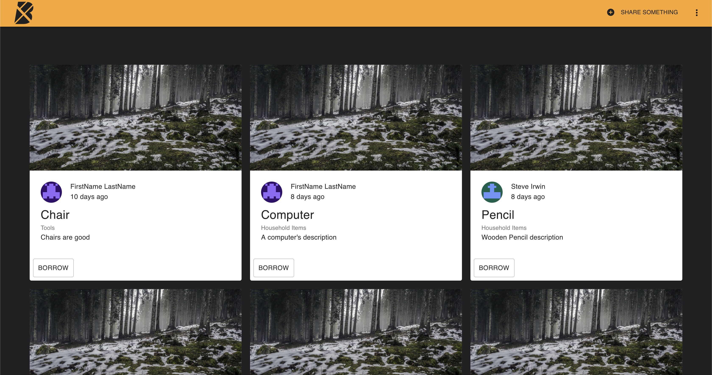
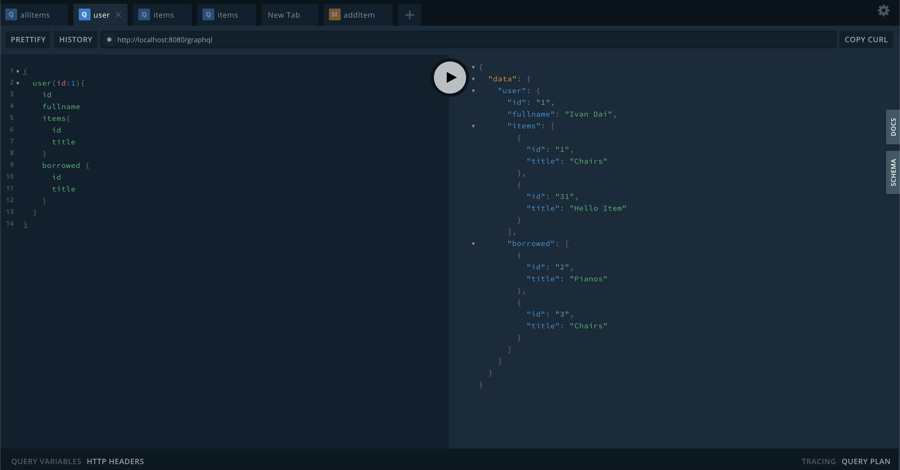

# Boomtown Application

## Screenshot




## Project Description

Boomtown enables a user to borrow items and share items to the boomtown community. All the user has to do is create an account and everything else is already setup. The project uses React.js,Node.js, GraphQL, etc... in the background to manage the database and render content to the screen for the user.

## Server

Commands must be run from the `server` directory:

### Installation

```bash
yarn install
```

### Run

```bash
yarn run start:dev
```

## Client

Commands must be run from the `client` directory:

### Installation

```bash
yarn install
```

### Run

```bash
yarn start
```

### Build

```bash
yarn run build
```

# boomtown

## Technologies Used & Key Learnings

- Javascript
- Express
- ApolloServer
- PostgreSQL
- GraphQL

## Personal Experience/ Learning Objective

Increased understanding on data structures, servers, and javascript. Mainly using express, graphql and javascript.

## Author

- Ivan - https://github.com/Ivandaixiv
